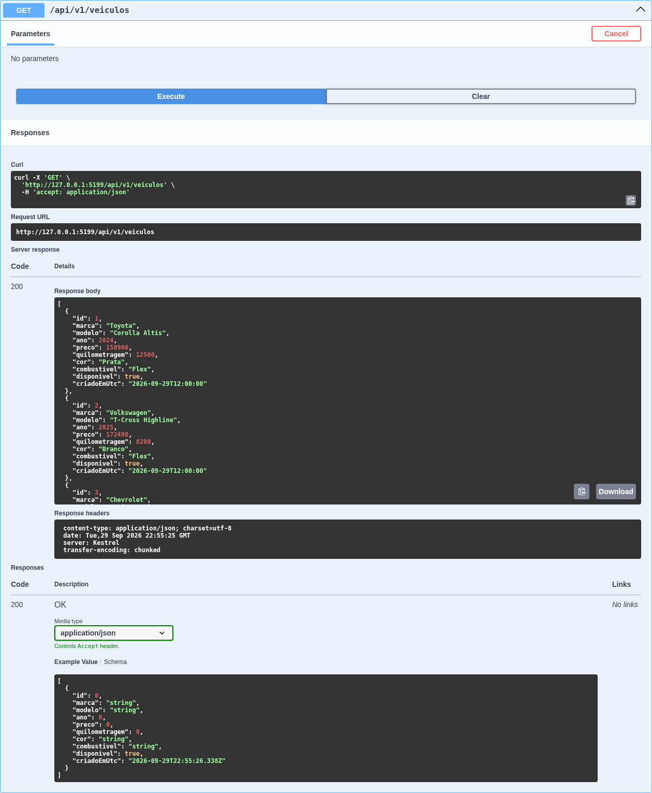
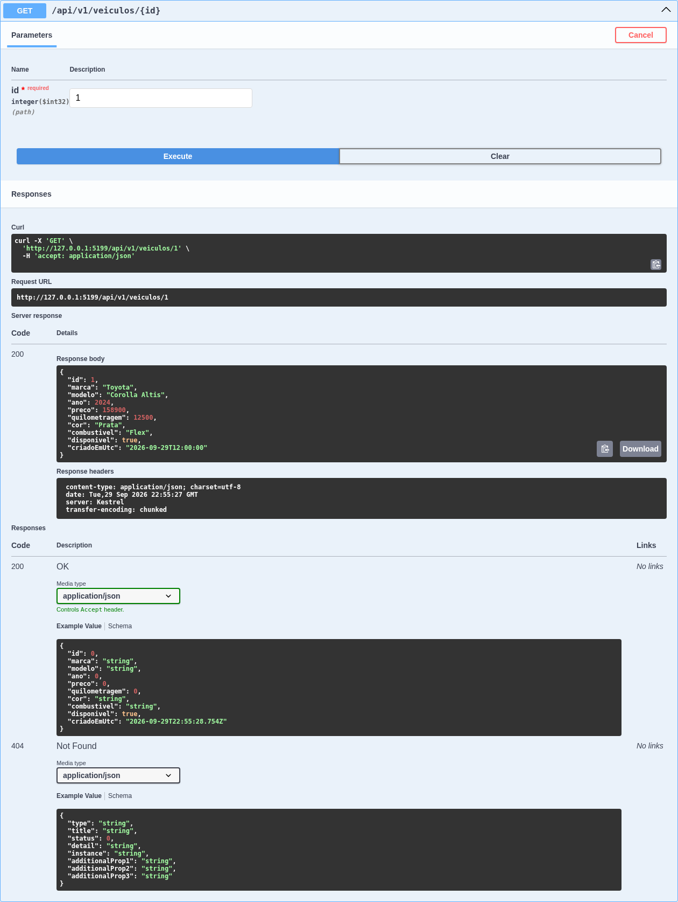
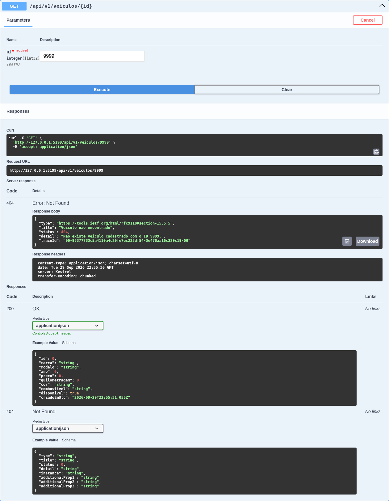
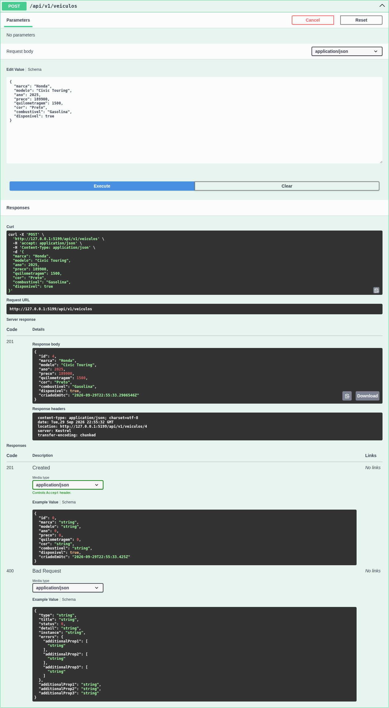
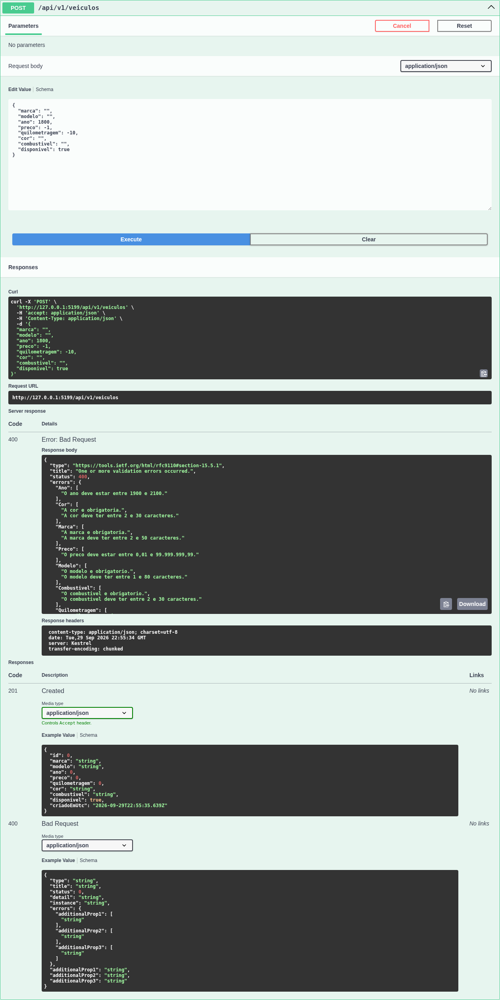
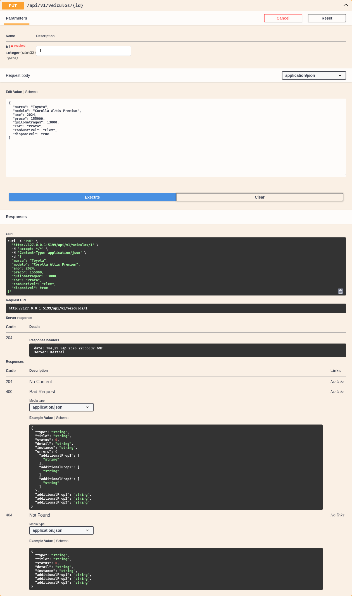
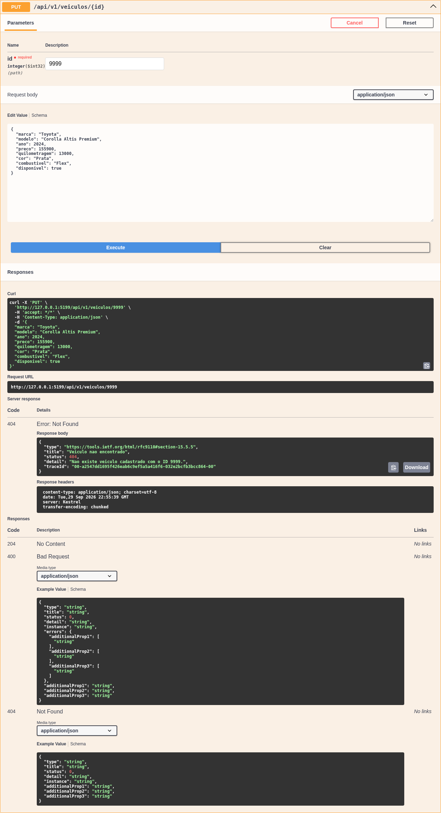
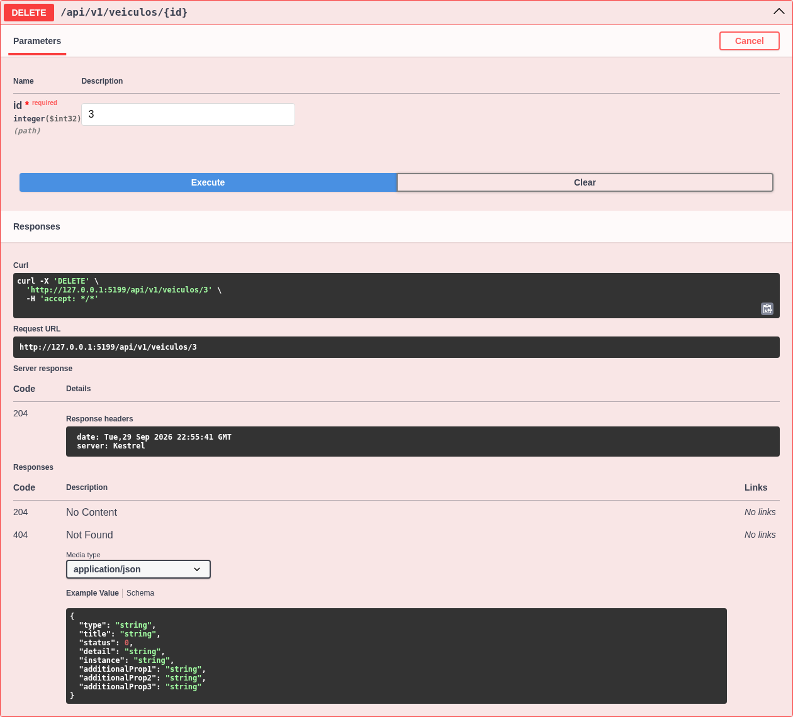
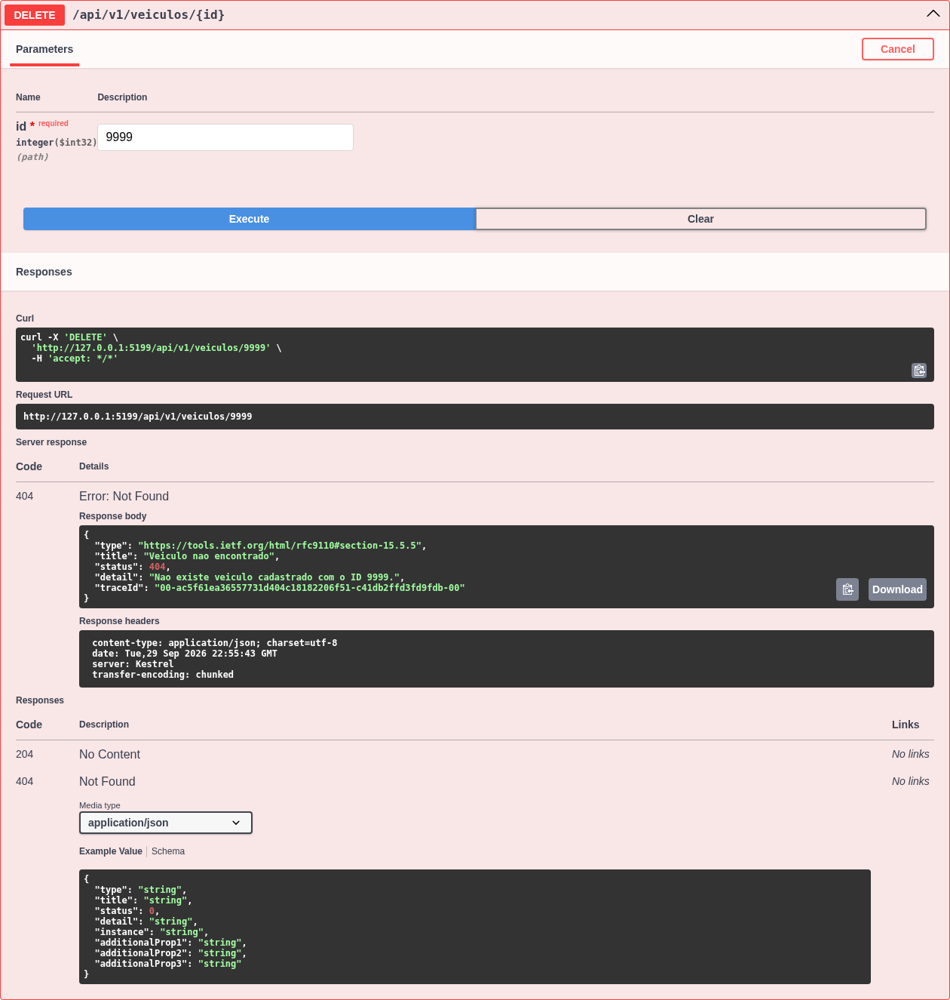
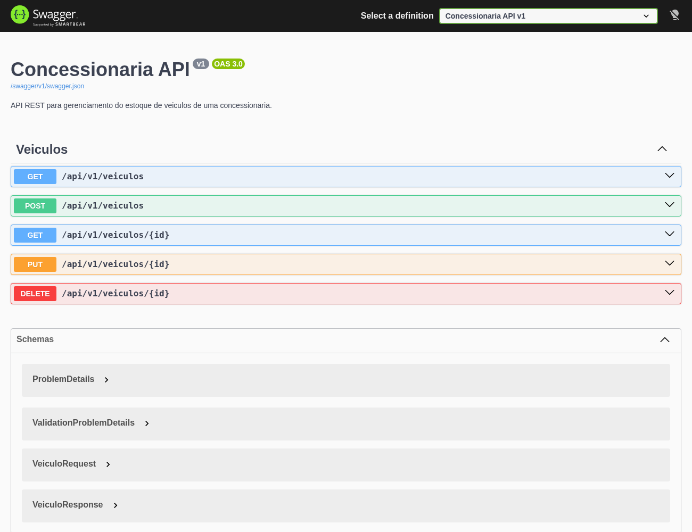

# Concessionaria API

API RESTful para gerenciamento dos veiculos disponiveis em uma concessionaria, desenvolvida em ASP.NET Core com .NET 10 e Entity Framework Core.

## Integrantes

| Nome completo | RM |
|---|---|
| Bruno Dominicheli | 554981 |
| Miguel Kapicius | 556198 |
| Thiago Ferreira | 555608 |

## Contexto do projeto

A Concessionaria API centraliza os dados dos carros anunciados por uma concessionaria. Ela permite que dealers e equipes comerciais consultem o estoque, cadastrem novos veiculos, atualizem informacoes como preco e quilometragem e removam anuncios que nao fazem mais parte do catalogo.

O projeto resolve o problema de manter o estoque de veiculos organizado e acessivel por uma interface HTTP padronizada, que pode ser consumida futuramente por sites, aplicativos, paineis de vendas ou integracoes com marketplaces.

## Tecnologias

- .NET 10 e ASP.NET Core Web API com Controllers
- Entity Framework Core 10
- SQLite
- Swagger / OpenAPI com Swashbuckle
- DataAnnotations para validacao dos DTOs

## Banco de dados

O projeto utiliza **SQLite**, armazenado no arquivo local `concessionaria.db`. A escolha simplifica a execucao e a avaliacao do projeto, pois nao exige a instalacao ou configuracao de um servidor de banco de dados.

O schema e controlado pelo Entity Framework Core. A migration inicial esta em `Migrations/20260929203352_InitialCreate.cs` e cria a tabela `Veiculos`, seus indices e tres registros iniciais.

## Estrutura do projeto

```text
.
├── Controllers/
│   └── VeiculosController.cs
├── Data/
│   └── AppDbContext.cs
├── DTOs/
│   ├── VeiculoRequest.cs
│   └── VeiculoResponse.cs
├── Migrations/
│   ├── 20260929203352_InitialCreate.cs
│   ├── 20260929203352_InitialCreate.Designer.cs
│   └── AppDbContextModelSnapshot.cs
├── Models/
│   └── Veiculo.cs
├── Properties/
│   └── launchSettings.json
├── docs/
│   └── prints/
├── ConcessionariaApi.http
├── Program.cs
└── ConcessionariaApi.csproj
```

## Modelo de dados

| Campo | Tipo | Regra |
|---|---|---|
| `id` | inteiro | Identificador gerado pelo banco |
| `marca` | texto | Obrigatorio, entre 2 e 50 caracteres |
| `modelo` | texto | Obrigatorio, entre 1 e 80 caracteres |
| `ano` | inteiro | Entre 1900 e 2100 |
| `preco` | decimal | Entre 0,01 e 99.999.999,99 |
| `quilometragem` | inteiro longo | Entre 0 e 2.000.000 |
| `cor` | texto | Obrigatorio, entre 2 e 30 caracteres |
| `combustivel` | texto | Obrigatorio, entre 2 e 30 caracteres |
| `disponivel` | booleano | Informa se o veiculo esta a venda |
| `criadoEmUtc` | data/hora | Gerado pelo servidor em UTC |

O `id` e o `criadoEmUtc` nao fazem parte do DTO de entrada porque sao controlados pelo servidor.

## Como executar

### Pre-requisitos

- .NET SDK 10 (`dotnet --version` deve retornar `10.x`)

### 1. Restaurar as dependencias

```bash
dotnet restore
```

### 2. Restaurar a ferramenta do EF Core

```bash
dotnet tool restore
```

### 3. Aplicar a migration

```bash
dotnet ef database update
```

A aplicacao tambem executa migrations pendentes automaticamente na inicializacao. O comando acima e mantido para demonstrar e documentar explicitamente o uso de migrations.

### 4. Executar a API

```bash
dotnet run --launch-profile http
```

A aplicacao estara disponivel em:

- API: `http://localhost:5199`
- Swagger UI: `http://localhost:5199/swagger`
- OpenAPI JSON: `http://localhost:5199/swagger/v1/swagger.json`

A rota raiz (`/`) redireciona para o Swagger.

## Versionamento

A versao faz parte da URL. A versao atual e `v1`, portanto a rota base do recurso e:

```text
/api/v1/veiculos
```

Esse formato permite adicionar uma futura `/api/v2/veiculos` sem quebrar clientes que utilizam a versao atual.

## Endpoints

| Metodo | Rota | Descricao | Sucesso | Erros |
|---|---|---|---|---|
| `GET` | `/api/v1/veiculos` | Lista todos os veiculos | `200 OK` | - |
| `GET` | `/api/v1/veiculos/{id}` | Busca um veiculo pelo ID | `200 OK` | `404 Not Found` |
| `POST` | `/api/v1/veiculos` | Cadastra um veiculo | `201 Created` | `400 Bad Request` |
| `PUT` | `/api/v1/veiculos/{id}` | Atualiza um veiculo | `204 No Content` | `400 Bad Request`, `404 Not Found` |
| `DELETE` | `/api/v1/veiculos/{id}` | Exclui um veiculo | `204 No Content` | `404 Not Found` |

### Exemplo de cadastro

```bash
curl -i -X POST http://localhost:5199/api/v1/veiculos \
  -H "Content-Type: application/json" \
  -d '{
    "marca": "Honda",
    "modelo": "Civic Touring",
    "ano": 2025,
    "preco": 189900.00,
    "quilometragem": 1500,
    "cor": "Preto",
    "combustivel": "Gasolina",
    "disponivel": true
  }'
```

O retorno esperado e `201 Created`, com o veiculo criado no corpo e o header `Location` apontando para `/api/v1/veiculos/{id}`.

### Exemplo de validacao

```bash
curl -i -X POST http://localhost:5199/api/v1/veiculos \
  -H "Content-Type: application/json" \
  -d '{
    "marca": "",
    "modelo": "",
    "ano": 1800,
    "preco": -1,
    "quilometragem": -10,
    "cor": "",
    "combustivel": "",
    "disponivel": true
  }'
```

O retorno esperado e `400 Bad Request`, com os erros de validacao no formato `ValidationProblemDetails`.

Outras chamadas prontas para execucao estao no arquivo `ConcessionariaApi.http`.

## Tratamento de erros e boas praticas

- Controllers assincronos e acesso ao banco exclusivamente pelo `AppDbContext`
- DTO separado da entidade persistida
- Validacao automatica com `[ApiController]` e DataAnnotations
- Consultas de leitura com `AsNoTracking`
- Status codes REST adequados
- Respostas de erro no padrao `ProblemDetails`
- Header `Location` no cadastro
- Migration aplicada automaticamente na inicializacao
- Segredo ou credencial nao e necessario para o SQLite local

## Evidencias dos testes

Capturas executadas no Swagger UI (**Try it out > Execute**), em `docs/prints/`:

| Evidencia | Print |
|---|---|
| `GET /api/v1/veiculos` - `200 OK` |  |
| `GET /api/v1/veiculos/{id}` - `200 OK` |  |
| `GET` com id inexistente - `404 Not Found` |  |
| `POST` valido - `201 Created` |  |
| `POST` invalido - `400 Bad Request` |  |
| `PUT` existente - `204 No Content` |  |
| `PUT` id inexistente - `404 Not Found` |  |
| `DELETE` existente - `204 No Content` |  |
| `DELETE` id inexistente - `404 Not Found` |  |
| Visao geral do Swagger UI |  |

Para reproduzir: execute a API, abra `http://localhost:5199/swagger`, selecione um endpoint, clique em **Try it out**, preencha os parametros e clique em **Execute**.
